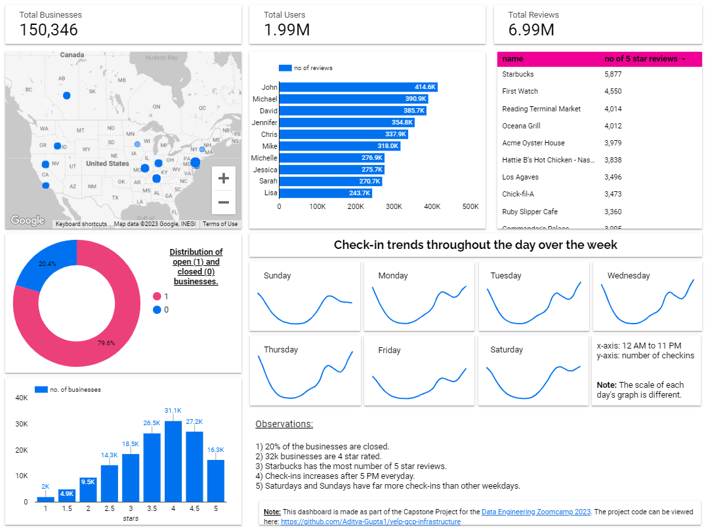

# YelpoSphere: An end-to-end data pipeline on GCP

YelpoSphere is a data pipeline that *extracts, transforms, and loads* data from Yelp's public dataset into a
GCP environment and performs various analyses on the data. The pipeline combines **GCS, BigQuery, Dataproc,
Cloud Composer, Cloud Run and Cloud Build** for data processing.

**YelpoSphere helps users provides insights into the restaurants business.**

It performs the following tasks:

* Loads the Yelp data into the **GCS** bucket.
* Cleans preprocess and ingest data from GCS to **BigQuery** using **Dataproc**.
* Uses **DBT** to normalize the data and performs exploratory data analysis (EDA) to identify trends and insights.
* Visualizes the results using **Google Data Studio**.
* Orchestrates different tasks using **Cloud Composer**.

# Data Source

The dataset is taken from the [Official Yelp Open Dataset](https://www.yelp.com/dataset) website. It is a subset of Yelp's businesses, reviews, and user data for personal, educational, and academic purposes. It is available in JSON files.

Here's a list of files available:

* `business.json`: Contains business data including location data, attributes, and categories.
* `reviews.json`: Contains full review text data including the user\_id that wrote the review and the business\_id the review is written for.
* `user.json`: User data including the user's friend mapping and all the metadata associated with the user.
* `checkin.json`: Checkins on a business.
* `tip.json`: Tips are written by a user of a business. Tips are shorter than reviews and tend to convey quick suggestions.

For a detailed description of the schema and examples, please visit the [official documentation](https://www.yelp.com/dataset/documentation/main) website.

# Tech Stack

* **Data Storage:** Google Cloud Storage (GCS)
* **Data Processing:** Dataproc
* **Data Transformations:** Data Build Tool (DBT)
* **Workflow Orchestration:** Cloud Composer
* **Infrastructure:** Terraform
* **Programming Language:** Python
* **Data Visualization:** Google Data Studio
* **Extras:** Cloud Build, Cloud Run

# Pipeline Overview

Here's a complete overview of the pipeline:

When an airflow DAG starts:

* It copies the data from a public GCS bucket into the project's data lake.
* It will wait for files to come in the GCS bucket's `data/raw` folder.
* Once the files are received, it submits Dataproc jobs to the cluster to ingest data into BigQuery raw tables.
* Once the data is ingested into raw tables, it will send a GET request to Cloud Run which will execute DBT jobs.
* DBT will perform transformations and load the data into a final dataset, making it ready for visualization.

This final dataset acts as a source for Google Data Studio which creates a dashboard using it. On the other hand:

* When commits are pushed to the main branch of the repo, a new Cloud Build is triggered. 
* This creates a new docker image that gets deployed on Cloud Run.

This ensures that DBT commands perform up-to-date transformations.

> **Note**: Cloud Build and Cloud Run are used to dockerize the DBT project and run DBT commands. This is required because Airflow does not have any convenient operators to run DBT core commands. And scheduling DBT cloud jobs is not supported in the FREE plan of DBT.
> 
> _In short, it is a workaround to orchestrate DBT with Cloud Composer._

# Prerequisites

* **Operating System:** Linux Preferred
* **Tools:** Python, Terraform, Git
* **GCP Resources:** A GCP Project, service account and GCloud CLI

# Setting up the pipeline

I've written a detailed blog with steps to recreate this pipeline. You can visit the blog [here](https://itsadityagupta.hashnode.dev/how-to-setup-yelposhere-pipeline-on-gcp) 
and follow the steps.

# Dashboard

I have used Google Data Studio to create a dashboard on top of the DBT models. You can either create your dashboard or simply view 
my dashboard [here](http://lookerstudio.google.com/reporting/03290c4d-e20a-4e61-9978-f4e0ae893ff5).

Here's a screenshot of my dashboard in case you're having any trouble viewing it:

# Improvements

Here are a few things that I think can be improved:

* Better code structure for Terraform.
* More data transformations on DBT.
* Adding more data quality tests on DBT models.
* Research about any easier way to orchestrate DBT with Airflow (although I did a LOT of research and asked a lot of different communities about this)
* CI/CD pipeline.

# Conclusion

This was my capstone project for the [Data Engineering Zoomcamp](https://github.com/DataTalksClub/data-engineering-zoomcamp).

I hope you like it. If you have any questions about the project, face any problems while following along or have a suggestion for me, feel free to comment or drop me a DM on [Twitter](https://twitter.com/itsadityagupta) or [Linkedin](https://www.linkedin.com/in/itsadityagupta/).